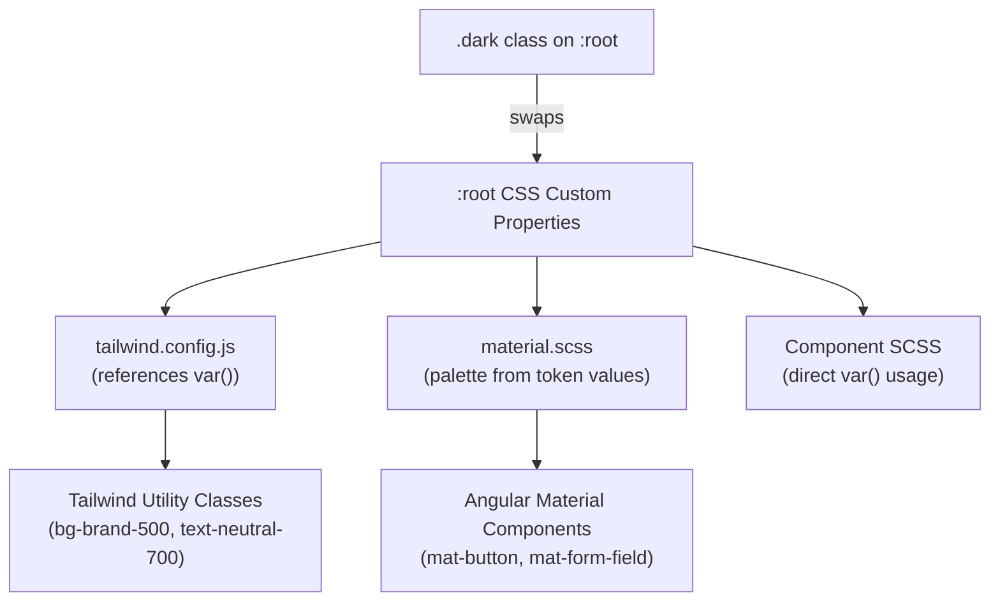
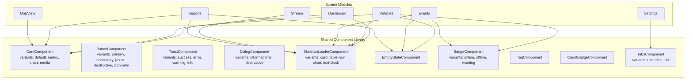
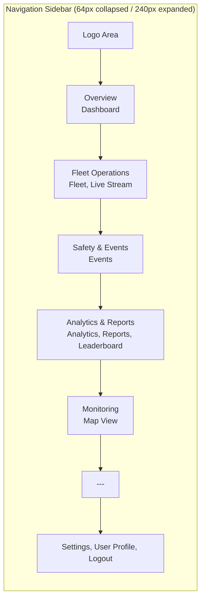

# Design Document: Premium UI Redesign

## Overview

This design covers the comprehensive visual and interaction overhaul of the Exeros Panel fleet management application. The redesign introduces a semantic design token system, a new shared component library, navigation restructuring, screen layout modernization, and polished interaction states — all while preserving existing functionality and the Angular 15 + Tailwind CSS 3 + Angular Material 15 tech stack.

The approach is incremental: foundation tokens and shared components are built first, then screens are migrated one at a time. This minimizes risk and allows parallel development across feature modules.

### Key Design Decisions

1. **CSS Custom Properties as single source of truth** — All tokens (color, spacing, typography, elevation, animation) are defined as `:root` CSS custom properties. Tailwind references them via `var()`, and SCSS variables are eliminated in favor of the custom properties. This ensures dark mode toggling via `.dark` class propagates everywhere automatically.

2. **Per-component Angular module pattern preserved** — New shared components (Card, Toast, Skeleton, Empty State, Badge, Tag, Tabs) each get their own module, consistent with the existing `src/app/shared/component/` convention.

3. **OnPush change detection + RxJS inputs** — All new components use `ChangeDetectionStrategy.OnPush`. Loading/state inputs are simple `@Input()` bindings; animation triggers use Angular's `@angular/animations` module.

4. **Tailwind utility-first with SCSS for complex animations** — Layout and spacing use Tailwind utilities. Keyframe animations (shimmer, spinner, fade) are defined in global SCSS and referenced via utility classes.

5. **Legacy color migration via find-and-replace** — Old color names (cultured, manatee, arsenic, chinese-silver, etc.) are mapped to new semantic tokens. A migration table is provided to guide the replacement.

## Architecture

### Token Architecture



All color, spacing, elevation, and animation tokens flow from CSS custom properties. Tailwind's `generateColorClass` helper (already in use) maps each token to a utility. Angular Material palettes are defined using the raw hex values from the brand scale, keeping Material's palette structure intact.

### Component Architecture



### Navigation Architecture



## Components and Interfaces

### Design Token Interfaces

```typescript
// Token type definitions for documentation/type-safety
interface ColorTokens {
  brand: Record<50 | 100 | 200 | 300 | 400 | 500 | 600 | 700 | 800 | 900, string>;
  neutral: Record<0 | 50 | 100 | 200 | 300 | 400 | 500 | 600 | 700 | 800 | 900 | 950, string>;
  success: { 50: string; 500: string };
  error: { 50: string; 500: string };
  warning: { 50: string; 500: string };
  info: { 50: string; 500: string };
}

interface SurfaceTokens {
  'surface-base': string;
  'surface-raised': string;
  'surface-overlay': string;
  'surface-sunken': string;
}

interface ElevationTokens {
  'elevation-none': string;
  'elevation-sm': string;
  'elevation-md': string;
  'elevation-lg': string;
}

interface AnimationTokens {
  'duration-fast': string;   // 150ms
  'duration-normal': string; // 200ms
  'duration-slow': string;   // 300ms
  'ease-default': string;    // ease-in-out
}
```

### Card Component

```typescript
@Component({
  selector: 'app-card',
  templateUrl: './card.component.html',
  styleUrls: ['./card.component.scss'],
  changeDetection: ChangeDetectionStrategy.OnPush
})
export class CardComponent {
  @Input() variant: 'default' | 'metric' | 'chart' | 'media' = 'default';
  @Input() loading = false;
}

// Metric variant sub-component
@Component({
  selector: 'app-card-metric',
  templateUrl: './card-metric.component.html',
  changeDetection: ChangeDetectionStrategy.OnPush
})
export class CardMetricComponent {
  @Input() value: string | number = '';
  @Input() label = '';
  @Input() trend?: { direction: 'up' | 'down'; percentage: number };
  @Input() sparklineData?: number[];
}
```

Template structure uses `ng-content` with select attributes:
```html
<!-- card.component.html -->
<div class="card" [class]="'card--' + variant" [class.card--loading]="loading">
  <ng-container *ngIf="!loading; else skeletonTpl">
    <div class="card__header"><ng-content select="[card-header]"></ng-content></div>
    <div class="card__body"><ng-content select="[card-body]"></ng-content></div>
    <div class="card__footer"><ng-content select="[card-footer]"></ng-content></div>
  </ng-container>
  <ng-template #skeletonTpl>
    <app-skeleton-loader [variant]="variant === 'metric' ? 'card' : variant === 'chart' ? 'chart' : 'card'"></app-skeleton-loader>
  </ng-template>
</div>
```

### Button Component (Redesigned)

```typescript
@Component({
  selector: 'app-button',
  templateUrl: './button.component.html',
  changeDetection: ChangeDetectionStrategy.OnPush
})
export class ButtonComponent {
  @Input() variant: 'primary' | 'secondary' | 'ghost' | 'destructive' | 'icon-only' = 'primary';
  @Input() size: 'sm' | 'md' | 'lg' = 'md';
  @Input() loading = false;
  @Input() disabled = false;
  @Input() ariaLabel?: string; // Required for icon-only
  @Output() buttonClick = new EventEmitter<void>();
}
```

### Toast Component

```typescript
@Component({
  selector: 'app-toast',
  templateUrl: './toast.component.html',
  styleUrls: ['./toast.component.scss'],
  changeDetection: ChangeDetectionStrategy.OnPush,
  animations: [
    trigger('slideIn', [
      transition(':enter', [
        style({ transform: 'translateX(100%)', opacity: 0 }),
        animate('300ms ease-out', style({ transform: 'translateX(0)', opacity: 1 }))
      ]),
      transition(':leave', [
        animate('200ms ease-in', style({ transform: 'translateX(100%)', opacity: 0 }))
      ])
    ])
  ]
})
export class ToastComponent implements OnInit, OnDestroy {
  @Input() variant: 'success' | 'error' | 'warning' | 'info' = 'info';
  @Input() message = '';
  @Input() duration = 5000;
  @Input() showCloseButton = true;
  @Output() dismissed = new EventEmitter<void>();

  progress = 100;
}
```

### Dialog Component

```typescript
@Component({
  selector: 'app-dialog-wrapper',
  templateUrl: './dialog-wrapper.component.html',
  styleUrls: ['./dialog-wrapper.component.scss'],
  changeDetection: ChangeDetectionStrategy.OnPush,
  animations: [
    trigger('scaleIn', [
      transition(':enter', [
        style({ transform: 'scale(0.95)', opacity: 0 }),
        animate('200ms ease-out', style({ transform: 'scale(1)', opacity: 1 }))
      ]),
      transition(':leave', [
        animate('150ms ease-in', style({ transform: 'scale(0.95)', opacity: 0 }))
      ])
    ])
  ]
})
export class DialogWrapperComponent {
  @Input() variant: 'informational' | 'destructive' = 'informational';
}
```

### Skeleton Loader Component

```typescript
@Component({
  selector: 'app-skeleton-loader',
  templateUrl: './skeleton-loader.component.html',
  styleUrls: ['./skeleton-loader.component.scss'],
  changeDetection: ChangeDetectionStrategy.OnPush
})
export class SkeletonLoaderComponent {
  @Input() variant: 'card' | 'table-row' | 'chart' | 'text-block' = 'text-block';
}
```

### Empty State Component

```typescript
@Component({
  selector: 'app-empty-state',
  templateUrl: './empty-state.component.html',
  changeDetection: ChangeDetectionStrategy.OnPush
})
export class EmptyStateComponent {
  @Input() illustration = '';
  @Input() heading = '';
  @Input() description = '';
  @Input() ctaLabel?: string;
  @Output() ctaClick = new EventEmitter<void>();
}
```

### Badge, Tag, and Count Badge Components

```typescript
@Component({
  selector: 'app-badge',
  template: `
    <span class="badge" [class]="'badge--' + status">
      <span class="badge__dot"></span>
      <span class="badge__label">{{ label }}</span>
    </span>
  `,
  changeDetection: ChangeDetectionStrategy.OnPush
})
export class BadgeComponent {
  @Input() status: 'online' | 'offline' | 'warning' = 'offline';
  @Input() label = '';
}

@Component({
  selector: 'app-tag',
  template: `<span class="tag" [style.--tag-color]="color"><ng-content></ng-content></span>`,
  changeDetection: ChangeDetectionStrategy.OnPush
})
export class TagComponent {
  @Input() color = 'var(--brand-500)';
}

@Component({
  selector: 'app-count-badge',
  template: `<span class="count-badge">{{ count }}</span>`,
  changeDetection: ChangeDetectionStrategy.OnPush
})
export class CountBadgeComponent {
  @Input() count: number | string = 0;
}
```

### Tabs Component

```typescript
@Component({
  selector: 'app-tabs',
  templateUrl: './tabs.component.html',
  styleUrls: ['./tabs.component.scss'],
  changeDetection: ChangeDetectionStrategy.OnPush
})
export class TabsComponent {
  @Input() variant: 'underline' | 'pill' = 'underline';
  @Input() tabs: TabItem[] = [];
  @Output() tabChange = new EventEmitter<number>();
  activeIndex = 0;
}

interface TabItem {
  label: string;
  count?: number;
  disabled?: boolean;
}
```

## Data Models

### Color Token Values

```scss
// Light mode token values
:root {
  // Brand (orange scale, 500 = #ee8444)
  --brand-50: #fef4ee;
  --brand-100: #fde6d5;
  --brand-200: #fac9aa;
  --brand-300: #f6a474;
  --brand-400: #f2863c;
  --brand-500: #ee8444;
  --brand-600: #df5f18;
  --brand-700: #b94815;
  --brand-800: #933a19;
  --brand-900: #773217;
  
  // Neutral (gray scale)
  --neutral-0: #ffffff;
  --neutral-50: #f9fafb;
  --neutral-100: #f3f4f6;
  --neutral-200: #e5e7eb;
  --neutral-300: #d1d5db;
  --neutral-400: #9ca3af;
  --neutral-500: #6b7280;
  --neutral-600: #4b5563;
  --neutral-700: #374151;
  --neutral-800: #1f2937;
  --neutral-900: #111827;
  --neutral-950: #030712;
  
  // Semantic
  --success-50: #f0fdf4;
  --success-500: #22c55e;
  --error-50: #fef2f2;
  --error-500: #ef4444;
  --warning-50: #fffbeb;
  --warning-500: #f59e0b;
  --info-50: #eff6ff;
  --info-500: #3b82f6;
  
  // Surfaces
  --surface-base: var(--neutral-0);
  --surface-raised: var(--neutral-0);
  --surface-overlay: rgba(255, 255, 255, 0.8);
  --surface-sunken: var(--neutral-50);
  
  // Elevation
  --elevation-none: none;
  --elevation-sm: 0 1px 2px 0 rgba(0, 0, 0, 0.05);
  --elevation-md: 0 4px 6px -1px rgba(0, 0, 0, 0.1), 0 2px 4px -2px rgba(0, 0, 0, 0.1);
  --elevation-lg: 0 10px 15px -3px rgba(0, 0, 0, 0.1), 0 4px 6px -4px rgba(0, 0, 0, 0.1);
  
  // Animation
  --duration-fast: 150ms;
  --duration-normal: 200ms;
  --duration-slow: 300ms;
  --ease-default: ease-in-out;
  
  // Spacing (4px base)
  --space-1: 4px;
  --space-2: 8px;
  --space-3: 12px;
  --space-4: 16px;
  --space-5: 20px;
  --space-6: 24px;
  --space-7: 28px;
  --space-8: 32px;
  --space-9: 36px;
  --space-10: 40px;
  --space-11: 44px;
  --space-12: 48px;
}

// Dark mode overrides
.dark {
  --neutral-0: #111827;
  --neutral-50: #1f2937;
  --neutral-100: #374151;
  --neutral-200: #4b5563;
  --neutral-300: #6b7280;
  --neutral-400: #9ca3af;
  --neutral-500: #d1d5db;
  --neutral-600: #e5e7eb;
  --neutral-700: #f3f4f6;
  --neutral-800: #f9fafb;
  --neutral-900: #ffffff;
  --neutral-950: #ffffff;
  
  --surface-base: #0f172a;
  --surface-raised: #1e293b;
  --surface-overlay: rgba(30, 41, 59, 0.8);
  --surface-sunken: #020617;
  
  --elevation-sm: 0 1px 2px 0 rgba(0, 0, 0, 0.3);
  --elevation-md: 0 4px 6px -1px rgba(0, 0, 0, 0.4), 0 2px 4px -2px rgba(0, 0, 0, 0.3);
  --elevation-lg: 0 10px 15px -3px rgba(0, 0, 0, 0.5), 0 4px 6px -4px rgba(0, 0, 0, 0.4);
}
```

### Typography Scale

```scss
:root {
  --text-display: 600 28px/1.3 'Poppins', sans-serif;
  --text-heading-lg: 600 22px/1.3 'Poppins', sans-serif;
  --text-heading-md: 600 18px/1.4 'Poppins', sans-serif;
  --text-heading-sm: 600 15px/1.4 'Poppins', sans-serif;
  --text-body-lg: 400 15px/1.5 'Poppins', sans-serif;
  --text-body: 400 14px/1.5 'Poppins', sans-serif;
  --text-body-sm: 400 13px/1.5 'Poppins', sans-serif;
  --text-caption: 500 12px/1.4 'Poppins', sans-serif;
  --text-overline: 600 11px/1.4 'Poppins', sans-serif;
}

.text-display { font: var(--text-display); }
.text-heading-lg { font: var(--text-heading-lg); }
.text-heading-md { font: var(--text-heading-md); }
.text-heading-sm { font: var(--text-heading-sm); }
.text-body-lg { font: var(--text-body-lg); }
.text-body { font: var(--text-body); }
.text-body-sm { font: var(--text-body-sm); }
.text-caption { font: var(--text-caption); }
.text-overline { font: var(--text-overline); text-transform: uppercase; letter-spacing: 0.05em; }
```

### Legacy Color Migration Map

| Legacy Token | New Token |
|---|---|
| `cultured` | `neutral-50` |
| `chinese-white` | `neutral-100` |
| `anti-flash-white` | `neutral-100` |
| `platinum` | `neutral-200` |
| `chinese-silver` | `neutral-300` |
| `light-steel-blue` | `neutral-300` |
| `manatee` | `neutral-400` |
| `bright-gray` | `neutral-400` |
| `sonic-silver` | `neutral-500` |
| `dim-gray` | `neutral-500` |
| `arsenic` | `neutral-700` |
| `dark-electric-blue` | `neutral-700` |
| `outer-space` | `neutral-800` |
| `dust-storm` | `neutral-200` |
| `quartz` | `neutral-200` |
| `old-lace` | `brand-50` |
| `carmel` | `brand-600` |
| `main-primary` | `brand-500` |
| `main-primary--10` | `brand-50` |
| `main-primary--30` | `brand-100` |
| `extra-one` | `success-500` |
| `extra-one--10` | `success-50` |
| `extra-two` | `error-500` |
| `extra-two--10` | `error-50` |
| `extra-three` | `info-500` |
| `extra-three--10` | `info-50` |
| `extra-four` | `warning-500` |
| `extra-four--10` | `warning-50` |
| `new-gray-*` | `neutral-*` (matching shade) |

### Tailwind Config Structure

```javascript
// tailwind.config.js (new)
const tokenColor = name => `var(--${name})`;

module.exports = {
  darkMode: 'class',
  content: ['./src/**/*.{html,ts,tsx}'],
  theme: {
    colors: {
      transparent: 'transparent',
      current: 'currentColor',
      white: tokenColor('neutral-0'),
      black: tokenColor('neutral-950'),
      brand: {
        50: tokenColor('brand-50'),
        100: tokenColor('brand-100'),
        200: tokenColor('brand-200'),
        300: tokenColor('brand-300'),
        400: tokenColor('brand-400'),
        500: tokenColor('brand-500'),
        600: tokenColor('brand-600'),
        700: tokenColor('brand-700'),
        800: tokenColor('brand-800'),
        900: tokenColor('brand-900'),
      },
      neutral: {
        0: tokenColor('neutral-0'),
        50: tokenColor('neutral-50'),
        // ... through 950
      },
      success: { 50: tokenColor('success-50'), 500: tokenColor('success-500') },
      error: { 50: tokenColor('error-50'), 500: tokenColor('error-500') },
      warning: { 50: tokenColor('warning-50'), 500: tokenColor('warning-500') },
      info: { 50: tokenColor('info-50'), 500: tokenColor('info-500') },
      surface: {
        base: tokenColor('surface-base'),
        raised: tokenColor('surface-raised'),
        overlay: tokenColor('surface-overlay'),
        sunken: tokenColor('surface-sunken'),
      },
    },
    spacing: {
      0: '0px',
      1: 'var(--space-1)',   // 4px
      2: 'var(--space-2)',   // 8px
      3: 'var(--space-3)',   // 12px
      4: 'var(--space-4)',   // 16px
      5: 'var(--space-5)',   // 20px
      6: 'var(--space-6)',   // 24px
      7: 'var(--space-7)',   // 28px
      8: 'var(--space-8)',   // 32px
      9: 'var(--space-9)',   // 36px
      10: 'var(--space-10)', // 40px
      11: 'var(--space-11)', // 44px
      12: 'var(--space-12)', // 48px
    },
    boxShadow: {
      none: 'var(--elevation-none)',
      sm: 'var(--elevation-sm)',
      md: 'var(--elevation-md)',
      lg: 'var(--elevation-lg)',
    },
    extend: {
      fontSize: {
        display: ['28px', { lineHeight: '1.3', fontWeight: '600' }],
        'heading-lg': ['22px', { lineHeight: '1.3', fontWeight: '600' }],
        'heading-md': ['18px', { lineHeight: '1.4', fontWeight: '600' }],
        'heading-sm': ['15px', { lineHeight: '1.4', fontWeight: '600' }],
        'body-lg': ['15px', { lineHeight: '1.5', fontWeight: '400' }],
        body: ['14px', { lineHeight: '1.5', fontWeight: '400' }],
        'body-sm': ['13px', { lineHeight: '1.5', fontWeight: '400' }],
        caption: ['12px', { lineHeight: '1.4', fontWeight: '500' }],
        overline: ['11px', { lineHeight: '1.4', fontWeight: '600' }],
      },
    },
  },
  plugins: [],
};
```

### Shimmer Animation

```scss
@keyframes shimmer {
  0% { transform: translateX(-100%); }
  100% { transform: translateX(100%); }
}

.skeleton {
  position: relative;
  overflow: hidden;
  background-color: var(--neutral-100);
  border-radius: 4px;

  &::after {
    content: '';
    position: absolute;
    inset: 0;
    transform: translateX(-100%);
    background: linear-gradient(
      90deg,
      transparent,
      var(--neutral-200),
      transparent
    );
    animation: shimmer 1.5s infinite;
  }
}
```

### Button Spinner Animation

```scss
@keyframes spin {
  to { transform: rotate(360deg); }
}

.btn-spinner {
  border: 2px solid currentColor;
  border-top-color: transparent;
  border-radius: 50%;
  animation: spin 0.75s linear infinite;

  .btn--sm & { width: 16px; height: 16px; }
  .btn--md & { width: 20px; height: 20px; }
  .btn--lg & { width: 24px; height: 24px; }
}
```

